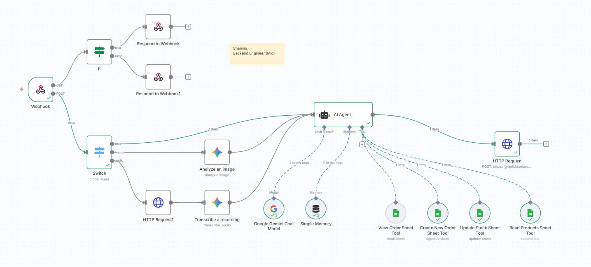
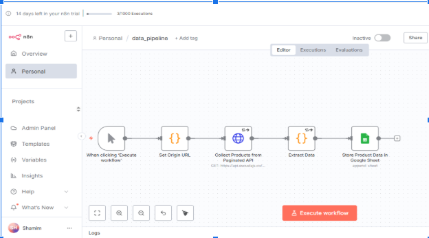
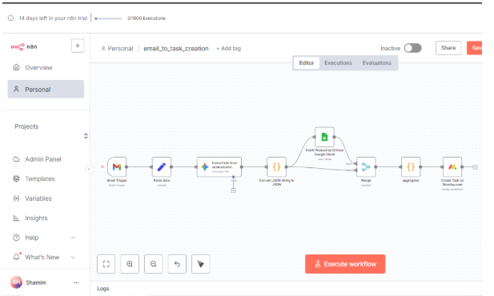

### 🧠 What is n8n?

**n8n** (short for *“nodemation”*) is a **powerful open-source workflow automation tool** that lets you connect different services and APIs — with or without code. It allows you to build **automated workflows** that handle data processing, API communication, and event-based triggers visually through an intuitive editor.

With n8n, you can:

* Automate repetitive tasks between multiple apps and APIs
* Create complex logic using conditionals, loops, and custom code nodes
* Integrate with hundreds of popular platforms like **Google Sheets**, **Facebook GraphQL**, **OpenAI/Gemini**, **Slack**, **Stripe**, and more
* Host it **locally** or deploy it on **cloud platforms** for full control and scalability

In this project, n8n acts as the **core workflow engine** that:

* Listens for incoming messages from Facebook Messenger
* Analyzes user input using AI
* Fetches product data from Google Sheets
* Sends the processed response back to Messenger through a webhook

This makes n8n the **central brain** that connects all AI and automation components together.

---

# 🧠 Automation Workflow – Get Levrg Bangladesh Ltd Assessments Solution for AI/Automation Role

This project implements an **end-to-end e-commerce automation workflow** using **n8n**, integrating **API data collection, AI-powered email processing**, and **task creation in Monday.com**.
The workflow connects product data with customer requests received via email and automatically creates structured tasks linked to the correct products.

---

## 🚀 Overview

The workflow performs the following core automations:

1. **Collect product data** from a **paginated API** and store it in **Google Sheets** in a structured format.
2. **Monitor incoming customer emails**, extract relevant order details, and process them using **AI (Gemini/OpenAI)** for clean, structured information.
3. **Create a new task in Monday.com**, automatically linking it with product details (name, price, category) from Google Sheets based on the product ID or name mentioned in the email.

---

## ⚙️ Step 1 – Product Data Pipeline

### Functionality

* Connects to the provided **paginated product API**.
* Iterates through all pages using an **incremental pagination loop** until all products are fetched.
* Combines all pages’ results into a single array using the **Merge and Function nodes**.
* After collecting all data, the workflow pushes it into **Google Sheets** with the following columns:

  * **Product ID**
  * **Name**
  * **Price**
  * **Category**

### Key Constraint

The workflow ensures that **all pages are fetched first** before any processing or insertion begins, maintaining full dataset integrity.

---

## ✉️ Step 2 – Email → Task Creation

### Functionality

* Uses the **Gmail Trigger** node to detect new incoming emails.
* Extracts relevant fields from the email body, such as:

  * Product Name or Product ID
  * Quantity
  * Delivery Date
  * Customer Name, Address, and Phone
* Passes the extracted text to an **AI Node (Gemini 2.5 Flash)** for natural language processing and structuring into a standardized task format.
* Matches the referenced product in **Google Sheets** by either product ID or name.
* Creates a **new task in Monday.com** using the AI-structured data and includes product details (name, price, category).

---

## 🔗 Step 3 – Product Reference Integration

* Performs a **lookup in Google Sheets** to find the exact product record.
* Appends product data (price, category, etc.) to the task creation payload.
* Ensures that every Monday.com task includes a clear reference between the **email order** and the **product record**.

---

## ⚡ Error Handling Strategy

To make the automation reliable and fault-tolerant:

* **API Failures:**

  * Added conditional checks and retry logic for failed API calls.
  * Logs error responses in a separate Google Sheet tab for debugging.
* **Missing Product Reference:**

  * AI generates a fallback message prompting manual verification when product data isn’t found.
* **AI Processing Error:**

  * Default to a template-based fallback task description if the AI node fails.
* **Email Parsing Failures:**

  * If essential details (e.g., quantity or ID) are missing, workflow logs the email for manual review.

---

## 🧩 Assumptions

* The product API returns data in a paginated JSON format with a clear `nextPage` or `page` indicator.
* Product IDs and names are unique for lookup consistency.
* All email communications follow a semi-structured format containing identifiable product references.
* Monday.com API credentials have sufficient permissions for task creation and data updates.

---

## 📂 Deliverables

* ✅ `data_pipeline.json` – Complete workflow export file.

* ✅ `email_to_task_creation.json` – Project documentation (this file).
